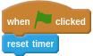
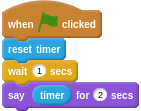

A timer lets you record how many seconds pass between events in Scratch.

- You can find the timer in the __Sensing__ menu. To use a timer in your script, the first thing you want to do is `reset` it.

	

- Now the timer will be set to `0`. You can use the timer to find out how many seconds have passed.

	
