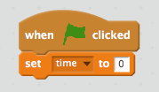
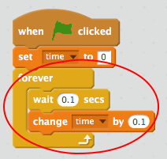

A timer lets you record how many seconds pass between events in Scratch.

+ Create a new variable called __time__.

[[[generic-scratch-add-variable]]]

+ When the green flag is clicked, start by setting the `time` to 0.

+ You can then increase your time variable, making sure to wait for the same amount of time.

